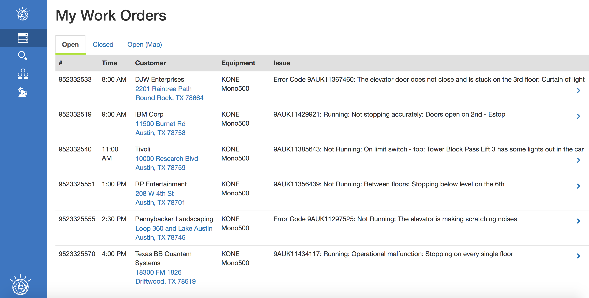
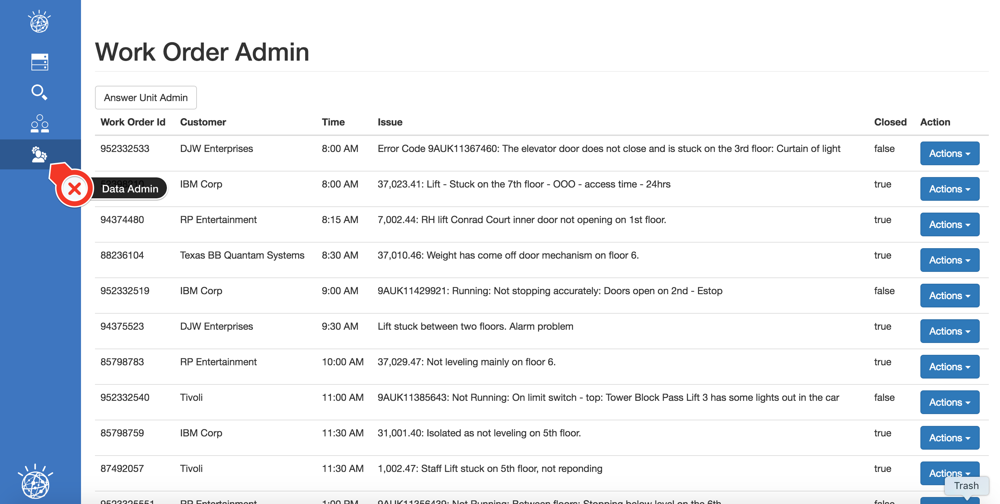
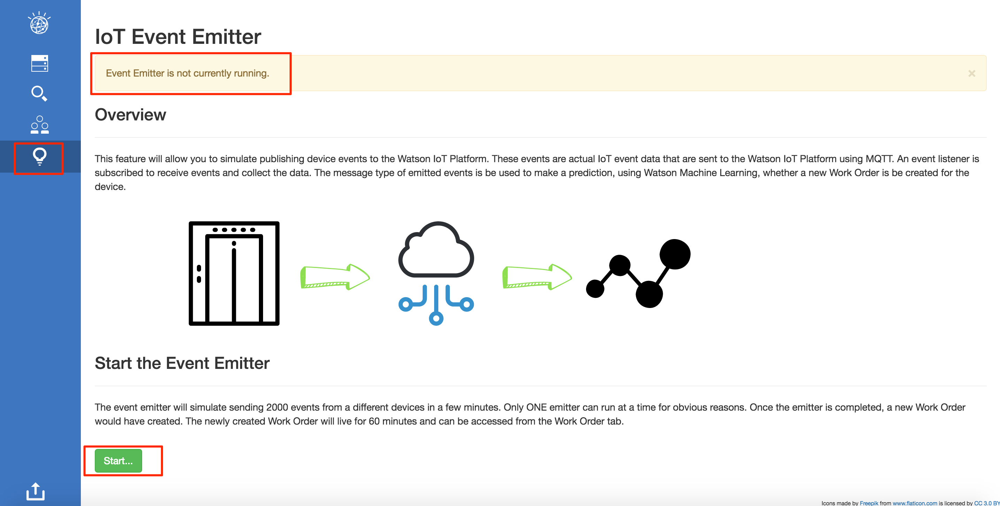

# Field Service Advisor Accelerator

## Overview

This Accelerator is also known as Field Service Technician

This Watson Accelerator demonstrates the following;
- Watson will match "Best Solution" with problem description.
- Technician can ask Watson question.
- IoT data is processed and triggers a Work Order.  Work Order is triggered based on Predictive Analytics.
- The use of Predictive Analytics to indicate component that should be replaced.


# Description

This Accelerator provides you with a Order Management Dashboard that is used by technicians in the field.  The technician can view orders, review best solutions and search for solutions.  There are a number of helpful features, for example, maps in the application
as well.

The Accelerator comes with a predefined number of Customers and Work Orders that are used within the application to represent the use case.  The values within these items can be modified to represent a unique story.

## Work Orders
Work Orders are the core to what is displayed to the user.  A work order can either be open or closed.  When a work order is closed, then it will have a solution.  A solution is a reference to an Answer unit.
## Customers
Customer are reused across work orders.  That means a single customer can have multiple work orders.  A Customer is related to a work order with their Customer Name property.  If the name of the customer is modified, then it should be modified on all the related work orders as well.
## Similarities
Similarities are used to show the similar work orders for the particular issue.  This data is mocked up and can be modified is required.  The work orders in the similarities data must exist in the work orders database.
## Answer Units
This answer units is the reference between what is displayed to the user and what was index in the Retrieve and Rank Service.  The application provides you with the ability to load documents into the retrieve and rank service that will also be added to the Answer Units database.  If the R&R tooling is used, then there won't be a connection between the answer units and the R&R service and the application won't function.

# Required Services

This Accelerator requires 5 services to be created.  You can reuse services by binding existing services to this application.

- IBM Cloudant noSql Database
- Document Conversion
- Retrieve and Rank
- Watson Machine Learning
- Watson IoT Platform (For MQTT Brokering only)

# Document Preparation

This Accelerator is a 100% dependent on properly curated content to be indexed by the R&R service.  Some content is better suited than others, but should at least conform to the following requirements.

1. Each answer should be in a single document.  That means, if you have multiple sections in a manual that each describe a solution, the larger document should be broken up into smaller documents, each only containing 1 solution.
2. Each document should have relevant text that will result in a query resolving to the particular document.
3. In case of PDF documents, the documents should not consist of images only.  Document conversion will not extract text from images.
4. Please read the documentation on Document Conversion.

# Setup Instructions


The setup is done in 3 primary steps.  You will download the code, configure the code and then deploy the code to Bluemix.  If you would
like to run the code locally, there will be one more step to configure the credentials locally.

> Think of a name for your application.  The name must be unique within Bluemix, otherwise it won't deploy.  This name will be used in a number of steps to get the application up and running.

## Prerequisites
The application requires the following applications

1. Node (6.9+) Application runtime environment
2. NPM (3.10+) Server side dependency management
3. Gulp (3.9+) `npm install -g gulp`
4. Angular CLI (1.0.0-rc.4) `npm install -g ng-cli@latest`

Note: Please read the upgrade instructions for Angular CLI when you upgrade or install the component.

## Downloading the code

1. Clone the app to your local environment from your terminal using the following command:
  `
  git clone https://github.ibm.com/Watson-Solutions-Lab/field-service-advisor-starter-app.git
  `
2. `cd` into this newly created directory
3. Edit the manifest.yml file and replace the name and host values ```field-service-advisor-starter-app``` with our own unique name you came up with.
4. Save the manifest.yml file.
5. Edit the package.json file and modify the application name as well.

### Configuration files

There are 2 sample configuration files that are required by the application.

The `env-var-sample.json` file should be renamed to `env-var.json` before the application is executed locally or on Bluemix.  This file is only required to be modified for the IoT Platform integration and is explained later in this document.

The `vcap-local-example.json` file should be renamed to `vcap-local.json` before the application is executed locally.  This file contains your service credentials required to run the application locally.  If the app is run on Bluemix, it will use the VCAP service information on Bluemix.  The sample file is a skeliton of what is required, but, you have to fill in the details.

## Setting up Bluemix

1. If you do not already have a Bluemix account, [sign up here](https://console.ng.bluemix.net/registration).
2. Log into Bluemix with your own credentials.
3. Create a new application by clicking on the Create App button on the Bluemix Dashboard.
4. On the left navigation, select Cloud Foundry Apps.
5. Click on the SDK for Node.js option on the right.
6. Enter your unique application name you though of before and click the Create button.
7. Wait until the application is started and available.
8. From the Bluemix Dashboard, select the newly created application.
9. Select Connections on the left.

### Create the following services using the procedure below

> Cloudant NoSql Database

> Document Conversion

> Retrieve and Rank

> Internet of Things Platform

> Watson Machine Learning

1. Click on the Connect new button.
2. Search for the service you would like to create.
3. Create the service using the free, light or standard plans.
4. Bind it to your application.
5. Restage the application.

### Deploy the Predictive Models

There are 2 predictive models that come with this Accelerator.  The can be found in the spss-modeller folder in this repo.  Use the Watson Machine Learning service dashboard to deploy both these models to your instance.  

### IoT Platform Setup

Once you have created your IoT Platform service, you will be required to define 2 new applications.  The first being an app that will represent the sender (device) of the events, and the second being the receiver of the events.  

Launch the IoT Platform dashboard and navigate to the Apps page.  Create the 2 new applications using the Generate API Keys button.  

Record the Keys and Tokens and copy/paste them into your env-vars.json file using the following keys at the bottom of the file.
```
"IOT_LISTENER_KEY": "",
"IOT_LISTENER_TOKEN": "",
"IOT_SENDER_KEY": "",
"IOT_SENDER_TOKEN": ""
```

## Configuring the application

This Accelerator is self-configuring.  When the application starts up the first time, in Bluemix, the Cloudant databases will be created and populated with the data required to run the application.  The Retrieve and Rank service will also be configured with a Cluster, Configuration and Collection, ready for documents to be indexed.

If you run the application locally the first time, you must configure the vcap-local.json file first!!!

## Running the app on Bluemix

1. Open the `manifest.yml` file and change the `name` and `host` values to your application name.

  The host you choose will determinate the subdomain of your application's URL:  `<host>.mybluemix.net`

2. Connect to Bluemix in the command line tool and follow the prompts to log in

  ```
  $ cf login -a https://api.ng.bluemix.net
  ```
3. Push the app to Bluemix, but don't start it yet.  We would need to bind the services to the new application before starting it up.

  ```
  $ cf push
  ```

4. The application should now be running on Bluemix.  You can access the application URL using the application name you defined in the manifest.yml file with a '.mybluemix.net' appended to it.

7. The application is secured with a username and password.

8. Continue to the next step to do some additional configuration within the application.

## Using the Admin Function to complete the Configuration

The first time the application starts up, the required databases will be created and loaded with data.  The Retrieve and Rank service will not be loaded with data.  To do that follow these steps.



1. Log into the application using the credentials username = ```admin``` and password = ```@dm1n```.
2. On the left sidebar, select the Admin icon (4th down).

### Add documents to the application
3. Select the Answer Units Admin button.
4. Select the Add New Answer Unit button.
5. Select a pre-curated document to upload to Retrieve and Rank and select the Review button.
6. Update or modify the Title to something uniquely identify the document to you and the user.
7. Add a number value to the Estimated time in minutes as well as the Success Heuristic.  The Success Heuristic is the % rate of success for this particular passage displayed to the user.  Make it a number larger that 70% to be realistic.
8. Select the Index button.
9. Repeat this step for all your documents.

### Reference solutions (Answer Units) to closed Work Orders

10. Select the Work Orders Admin button to view the list of Work Orders.
11. Closed Work Orders have solutions.  You will use the documents you just indexed as solutions to the closed work orders.
12. Edit each of the work order that is closed (Closed column in the table is true)
13. From the Solution Answer Id dropdown, select an appropriate document as the solution.
14. Save the work order.

### Update the Work Order with realistic data

15. Edit the work orders (Open and Closed) and modify the following values for your own use case.

    - Equipment Name
    - Issue Snippet
    - Issue Text
    - Parts List
    - Tools List

> The Issue Snippet field is used when querying the Retrieve and Rank service.  The text is separated with a colon ```:``` and only the LAST section is used to query R&R.  When this value is defined, make sure that it resolve to the appropriate document.

## Running the IoT Event Emitter

To run the Device emulation, you have to log in as the iot-device persona.  This will provide you with some additional functionality to start emitting events as a device.

There are some basic constraints around running this.

1. Only 1 emitter can be run at a single time.
2. A single order with id 10000001 will be created based on the event data and the predictive model.
3. The new order will exist for an hour after it was created.  It will automatically be deleted after it expires.
4. To complete this order, and delete it, use the Start order and Complete order on the normal screens.



Once logged in, select the bulb icon on the left.  Check the status at the top of the screen and when no other emitters are running, click the start button.  

The status will indicate the percentage complete.  Once the run is completed, the order will be created and you can run the normal use case and complete the order.

## Running the app locally

To run the application locally (your own computer), you have to install additional Node.js modules and configure the application with some credentials that is provisioned on Bluemix.

### Starting the application
There are a few quick steps required to stand up the application. In general, the required tasks are.

1. Install the server and client dependencies
2. Commission the required services
3. Configure the environment variables in manifest.yml (cloud deployment) or .env (local deployment)
4. Build and run or deploy

#### Installing the server and client dependencies
The server dependencies are controlled and defined in [the main package.json](./package.json).

The client dependencies are controlled and defined in [the client package.json](./client/package.json).

To install all required dependencies to both build the application and execute the application, execute the following script from the project root.

Linux/Unix/MacOs

```
sh ./install.sh
```
or Windows

```
./install.bat
```

Alternatively, the dependencies can be installed manually with the following commands from project root

```
npm install
```

(cd client/ && npm install)

## The Local CVAP file

The vcap-local.json file consist of your Bluemix service credentials when you run the application locally.

This file must be updated with your service credentials before the application can be executed.

1. On the Bluemix Application page, select the Connections option on the left.
2. Select each of the services you provisioned earlier and view the credentials.
3. Copy the credentials using the 'copy' icon.
4. Edit the vcap-local.json file.
5. Paste the content of the clipboard into the vcap.local file.
6. The structure of this file consist of a service name and a json object, but the pasted value is wrapped in another ```{ }``` that should be removed.
7. A sample of what it should look like below;

```
{
  "cloudantNoSQLDB": [
    {
      "credentials": {
        ...
      },
      "syslog_drain_url": null,
      "label": "cloudantNoSQLDB",
      "provider": null,
      "plan": "Lite",
      "name": "Cloudant NoSQL DB-ss",
      "tags": [
        "data_management",
        "ibm_created",
        "ibm_dedicated_public"
      ]
    }
  ],
  "document_conversion": [
    {
      ...
    }
  ]
}
```

8. Once all the credentials are in place, the application can be starter with ```gulp develop```.

## Accessing the Application

There are 3 specific users required for this application.

1. The Field Technician is the persona that will log in, few the orders, search for solutions and work on order.  This persona will use the credentials `watson\p@ssw0rd` to log in.
2. The second persona is the Device that will send events via IoT to the application.  With this credentials, you will have access to the IoT Sender feature to initiate the devices sending events to the platform.  This persona will use the credentials `iot-device\d3v1ce` to log in.
3. The third persona is the administrator and is only to load and setup the data required to customize the application for your own needs.  You can log in with this persona using credentials `admin\@dm1n`.

The user names and passwords can be modified in the /server/boot/init-access.js file.
